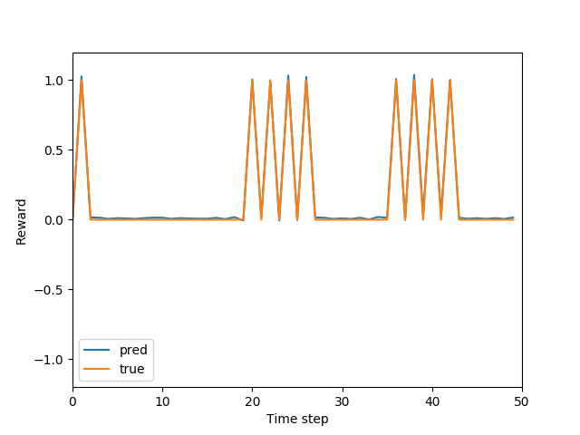

## RUDDER implementation in Chainer
#### About this repository
This repository is for my study about RUDDER technique.
Authors implemented RUDDER in tensorflow so I did in chainer.
For now, I only implemented the environment in the [tutorial page](https://widmi.github.io/).

#### Reference
* [RUDDER: Return Decomposition for Delayed Rewards](https://arxiv.org/abs/1806.07857)
* [tutorial page](https://widmi.github.io/)

#### Environment
* python 3.7.1
* numpy 1.15.4
* matplotlib 3.0.2
* chainer 5.1.0
* absl-py 0.6.1

#### Usage
`python RUDDER.py [some options]`  
The results (figures) are output to the directory `./result`.

`python RUDDER.py --help` shows some usable options.

#### Difference from author's implementation
* Padding starting frames, not only end frames
* Omit auxiliary losses
* Omit correction in calculating integrated gradients

#### Result
  
Pred is RUDDER output, which can predict true rewards, although RUDDER is given only accumulated reward information.
It seems to work correctly.

#### Future prospect
I'll try to reproduce the Atari game's result mentioned in the article.
